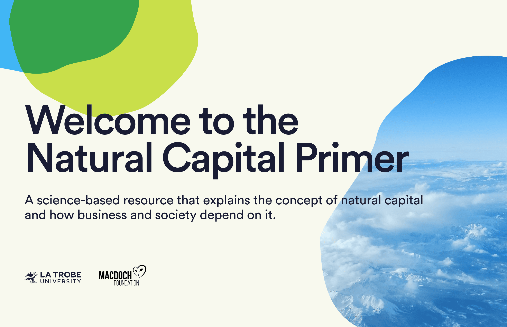

# Natural Capital Primer

A science-based resource that explains the concept of natural capital and how business and society depend on it.



## Dependencies

- Node.js (see version in [.nvmrc](https://github.com/Vizzuality/natural-capital-primer/tree/develop/.nvmrc))
- [pnpm](https://pnpm.io/)

## Install & run

### Native execution

Be sure to set the required environment variables before running the application - see the Environment variables section below for more details.

To install the dependencies, use:

```
pnpm install
```

To run the application in development mode, use:

```
pnpm run dev
```

To run the application in production mode, use:

```
pnpm run build
pnpm run start
```

### Docker

This project includes 2 docker configuration files:

- [Dockerfile](https://github.com/Vizzuality/natural-capital-primer/tree/develop/Dockerfile) aimed at development environments (may require tuning to work on different environments)
- [Dockerfile.prod](https://github.com/Vizzuality/natural-capital-primer/tree/develop/Dockerfile.prod) aimed at production environments

You can use either file to build a Docker image for this application. Be sure to set the required environment variables when running the container.

## Environment variables

See [src/env.mjs](https://github.com/Vizzuality/natural-capital-primer/tree/develop/src/env.mjs).